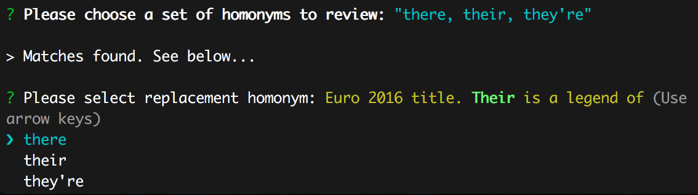

# homonym-helper-js
(JavaScript, Node.js) A program to check a text file to see if you've accidentally used a homonym of the word you intended to use. (e.g. there / their / they're; you're / your)



## Purpose

I've had this app idea in mind for awhile now. Homonyms are easy to gloss over, and spellcheckers don't always identify improper word use. I wanted to create an app in which the user makes an active choice in looking at the word in a smaller context and determining if it makes sense within that sentence.

Currently there are only two sets of homonyms in the dictionary, but I have plans to expand and improve the app in the future.

## Installation

To use the app, clone it from GitHub, install packages with `npm install` on the command line, and add a `.txt` file with text for review to the `/input` folder. use the following in the command line to run the app:

```
node index.js YOURFILENAME.txt
```

## Usage

There is a file titled `testing.txt` already in the input folder. Once you run the app, the revised file will be written to a new text file with the same name in the `/output` folder.

Right now the app will only work on one set of homonyms at a time, but after it is finished you'll be given the option to re-run the app, at which point the other set currently in the dictionary can be used.
